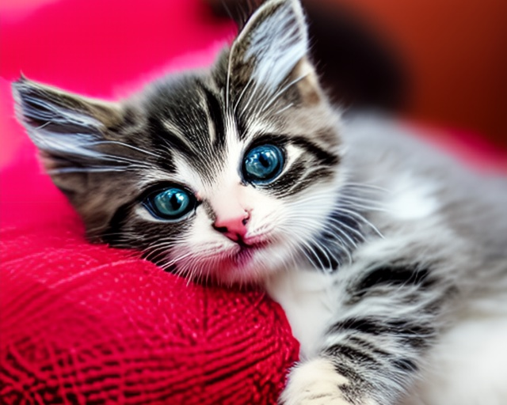

# OllamaChat - Ruby Chat Bot for Ollama

## Description

**ollama_chat** is a chat client, that can be used to connect to an ollama
server and enter chat conversations with the LLMs provided by it.

## Installation (gem)

To install **ollama_chat**, you can type

```
gem install ollama_chat
```

in your terminal.

## Usage

It can be started with the following arguments:

```
Usage: ollama_chat [OPTIONS]

  -f CONFIG      config file to read
  -u URL         the ollama base url, OLLAMA_URL
  -m MODEL       the ollama model to chat with, OLLAMA_CHAT_MODEL
  -s SYSTEM      the system prompt to use as a file, OLLAMA_CHAT_SYSTEM
  -c CHAT        a saved chat conversation to load
  -C COLLECTION  name of the collection used in this conversation
  -D DOCUMENT    load document and add to embeddings collection (multiple)
  -M             use (empty) MemoryCache for this chat session
  -E             disable embeddings for this chat session
  -S             open a socket to receive input from ollama_chat_send
  -V             display the current version number and quit
  -h             this help
```

The base URL can be either set by the environment variable `OLLAMA_URL` or it
is derived from the environment variable `OLLAMA_HOST`. The default model to
connect can be configured in the environment variable `OLLAMA_MODEL`.

The YAML config file is stored in `$XDG_CONFIG_HOME/ollama_chat/config.yml` and
you can use it for more complex settings.

### Example: Setting a system prompt

Some settings can be passed as arguments as well, e. g. if you want to choose a
specific system prompt:

```
$ ollama_chat -s sherlock.txt
Model with architecture llama found.
Connecting to llama3.1@http://ollama.local.net:11434 now…
Configured system prompt is:
You are Sherlock Holmes and the user is your new client, Dr. Watson is also in
the room. You will talk and act in the typical manner of Sherlock Holmes do and
try to solve the user's case using logic and deduction.

Type /help to display the chat help.
📨 user:
Good morning.
📨 assistant:
Ah, good morning, my dear fellow! It is a pleasure to make your acquaintance. I
am Sherlock Holmes, the renowned detective, and this is my trusty sidekick, Dr.
Watson. Please, have a seat and tell us about the nature of your visit. What
seems to be the problem that has brought you to our humble abode at 221B Baker
Street?

(Watson nods in encouragement as he takes notes)

Now, pray tell, what is it that puzzles you, my dear client? A missing item,
perhaps? Or a mysterious occurrence that requires clarification? The game, as
they say, is afoot!
```

### Example: Using a multimodal model

This example shows how an image like this can be sent to the LLM for multimodal
analysis:



```
$ ollama_chat -m llava-llama3
Model with architecture llama found.
Connecting to llava-llama3@http://localhost:11434 now…
Type /help to display the chat help.
📸 user> What's on this image? ./spec/assets/kitten.jpg
📨 assistant:
The image captures a moment of tranquility featuring a young cat. The cat,
adorned with gray and white fur marked by black stripes on its face and legs,
is the central figure in this scene. Its eyes, a striking shade of blue, are
wide open and directed towards the camera, giving an impression of curiosity or
alertness.

The cat is comfortably nestled on a red blanket, which contrasts vividly with
its fur. The blanket, soft and inviting, provides a sense of warmth to the
image. In the background, partially obscured by the cat's head, is another
blanket of similar red hue. The repetition of the color adds a sense of harmony
to the composition.

The cat's position on the right side of the photo creates an interesting
asymmetry with the camera lens, which occupies the left side of the frame. This
visual balance enhances the overall composition of the image.

There are no discernible texts or other objects in the image. The focus is
solely on the cat and its immediate surroundings. The image does not provide
any information about the location or setting beyond what has been described.
The simplicity of the scene allows the viewer to concentrate on the main
subject - the young, blue-eyed cat.
```

### Chat commands

The following commands can be given inside the chat, if prefixed by a `/`:

```
/copy                           to copy last response to clipboard
/paste                          to paste content
/markdown                       toggle markdown output
/stream                         toggle stream output
/location                       toggle location submission
/voice( change)                 toggle voice output or change the voice
/list [n]                       list the last n / all conversation exchanges
/clear [messages|links|history] clear the all messages, links, or the chat history (defaults to messages)
/clobber                        clear the conversation, links, and collection
/drop [n]                       drop the last n exchanges, defaults to 1
/model                          change the model
/system                         change system prompt (clears conversation)
/regenerate                     the last answer message
/collection [clear|change]      change (default) collection or clear
/info                           show information for current session
/config                         output current configuration ("/Users/flori/.config/ollama_chat/config.yml")
/document_policy                pick a scan policy for document references
/import source                  import the source's content
/summarize [n] source           summarize the source's content in n words
/embedding                      toggle embedding paused or not
/embed source                   embed the source's content
/web [n] query                  query web search & return n or 1 results
/links [clear]                  display (or clear) links used in the chat
/save filename                  store conversation messages
/load filename                  load conversation messages
/quit                           to quit
/help                           to view this help
```

### Using `ollama_chat_send` to send input to a running `ollama_chat`

You can do this from the shell by pasting into the `ollama_chat_send`
executable.

```
$ echo "Why is the sky blue?" | ollama_chat_send
```

To send a text from inside a `vim` buffer, you can use a function/leader like
this:

```
map <leader>o :<C-U>call OllamaChatSend(@*)<CR>

function! OllamaChatSend(input)
  let input = "Take note of the following code snippet (" . &filetype . ") **AND** await further instructions:\n\n```\n" . a:input . "\n```\n"
  call system('ollama_chat_send', input)
endfunction
```

## Download

The homepage of this app is located at

* https://github.com/flori/ollama\_chat

## Author

<b>OllamaChat</b> was written by [Florian Frank](mailto:flori@ping.de)

## License

This software is licensed under the <i>MIT</i> license.
